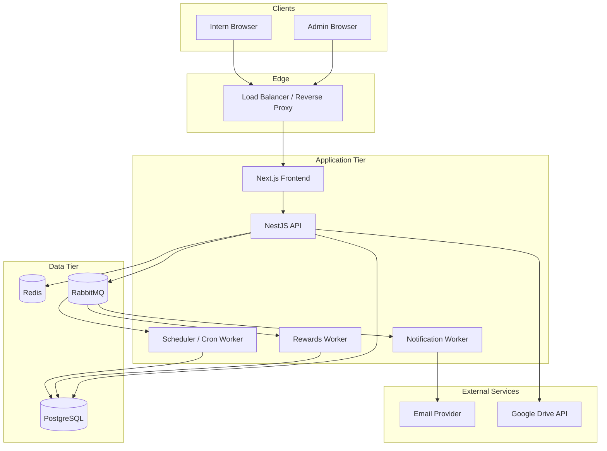

# Aarogya Virohan Internship Platform — Architecture Blueprint
**Updated architecture and implementation guide**

## 0. Recommended technology stack (current versions)
| Layer | Recommendation | Notes |
|---|---|---|
| Runtime | **Node.js 24.15.0 LTS** | Latest LTS on the official Node.js release page. |
| Backend framework | **NestJS 11.x** | Current Nest docs include the v10 → v11 migration guide. |
| Frontend framework | **Next.js 16.2.4** | Official docs list 16.2.4 as the latest version. |
| UI library | **React 19.2** | React docs list 19.2 as the latest version. |
| Database | **PostgreSQL 18.3** | Latest PostgreSQL release listed on the official release notes page. |
| ORM | **Prisma 7.7.0** | Latest Prisma ORM release in the changelog. |
| Cache | **Redis (stable, provider-supported build)** | Pin to the latest stable Redis-compatible managed offering; avoid pre-release tags in production. |
| Queue / event bus | **RabbitMQ 4.3.0** | Official RabbitMQ download page lists 4.3.0 as the latest release. |
| Container runtime | Docker | Use multi-stage builds. |
| CI/CD | GitHub Actions | Lint, test, build, deploy. |
| Observability | OpenTelemetry + Prometheus + Grafana + centralized logs | Production-grade baseline. |

> Version references should be pinned in lockfiles and deployment manifests. Re-check before each major rollout.

---

## 1. Executive summary

The Aarogya Virohan Internship Platform is a **single unified web application** with two role surfaces:

- **Admin**: manages interns, tasks, submissions, content, announcements, meetings, attendance, points, and analytics.
- **Intern**: views assigned work, submits deliverables, marks attendance, consumes content/announcements/meetings, and tracks progress.

The correct initial architectural choice is a **modular monolith**: one codebase, one deployment unit, clear internal domain boundaries, and a shared authentication/authorization layer. This keeps delivery speed high while preserving the option to split services later if usage grows.

### Core design goals
- **Fast delivery** with low operational overhead.
- **Strong RBAC** and object-level authorization.
- **Auditable workflows** for submissions, points, and admin actions.
- **Scalable read paths** using caching and indexed queries.
- **Reliable async processing** for notifications and points calculation.
- **Clean domain boundaries** to reduce coupling.

---

## 2. Product scope

### 2.1 User roles
| Role | Responsibilities | Access scope |
|---|---|---|
| Admin | Create/manage tasks, content, announcements, meetings, intern accounts; review submissions; award points; monitor analytics. | Full platform access. |
| Intern | View assigned tasks, submit work, track attendance, read content, view announcements/meetings, and inspect rewards. | Own data + shared public/intern data only. |

### 2.2 Functional scope
The platform includes:
- Authentication and session management
- Intern profile management
- Task assignment and review
- Submission workflow
- Attendance check-in / check-out
- Content library
- Announcements
- Meeting scheduling
- Rewards and leaderboard
- Analytics and reporting
- Audit logs
- Notifications
- Admin dashboard
- Migration support from Google Sheets / prototype data

---

## 3. Architecture overview

### 3.1 High-level system diagram


### 3.2 Architectural style
- **Frontend**: Next.js App Router, server components where appropriate, client components only where needed.
- **Backend**: NestJS modular monolith using domain modules.
- **Database**: PostgreSQL as the system of record.
- **Cache**: Redis for hot read data, rate limits, and ephemeral tokens.
- **Async processing**: RabbitMQ for domain events and job queues.
- **Infra**: containerized deployment to AWS ECS/Fargate, or a smaller managed platform for early MVP.

### 3.3 Key decisions
- Keep **business logic inside services**, not controllers.
- Use **DTO validation** at the API boundary.
- Use **transactions** for multi-table writes.
- Use **domain events** for side effects like notifications and point awards.
- Keep the **frontend role-aware**, but never trust it for authorization.

---

## 4. Domain decomposition

Each bounded context owns its data access patterns and service logic.

| Domain | Responsibilities | Key tables |
|---|---|---|
| Auth | Login, refresh, logout, password reset, session lifecycle. | `users`, `refresh_tokens`, `password_reset_tokens` |
| User Management | Intern/admin profile CRUD, status changes, onboarding. | `user_profiles` |
| Tasks | Create, assign, update, archive, search tasks. | `tasks`, `task_tags` |
| Submissions | Intern deliverables, review, revision cycles, approval history. | `submissions`, `submission_reviews` |
| Attendance | Check-in/out, daily status, monthly reports. | `attendance_records` |
| Content Library | Files, links, categories, project scoping, visibility. | `content_items`, `content_tags` |
| Announcements | Posts, visibility rules, pinning, expiry. | `announcements` |
| Meetings | Scheduling, invites, links, attendance notes. | `meetings`, `meeting_attendees` |
| Rewards | Points, badges, leaderboard, awards history. | `reward_events`, `badges` |
| Notifications | Email/queue notifications, templates, retries. | `notification_jobs`, `notification_templates` |
| Audit | Immutable admin activity records. | `audit_logs` |

### Boundaries
- A domain must not write directly into another domain’s tables.
- Cross-domain work happens through:
  - service interfaces,
  - transaction boundaries,
  - or published events.

Example: submission approval updates the submission, emits an event, and rewards/notifications react asynchronously.

---

## 5. Authentication and authorization

### 5.1 Authentication model
Use:
- **Access token**: short-lived JWT, ~15 minutes.
- **Refresh token**: long-lived, rotated, stored hashed in DB.
- **Password hashing**: bcrypt or Argon2id. Prefer Argon2id if the runtime and library support are stable in your environment.

### 5.2 Authorization model
- **Role-based access control (RBAC)** for admin vs intern.
- **Object-level authorization** for user-owned records.
- **Policy examples**:
  - intern can only view their own submissions,
  - intern can only mark their own attendance,
  - admin can access all analytics and all intern data.

### 5.3 Guard strategy
- `JwtAuthGuard` for authentication.
- `RolesGuard` for role checks.
- service-layer ownership checks for record-level access.

---

## 6. Data model

### 6.1 Naming and conventions
- Primary keys: **UUID**
- Timestamps: `created_at`, `updated_at`, `deleted_at` (soft delete where required)
- Enum fields: use database enums or constrained text values
- Foreign keys: indexed
- Every mutable table should contain an audit trail strategy

### 6.2 Core entities

#### `users`
| Column | Type | Notes |
|---|---|---|
| `id` | UUID PK | |
| `email` | TEXT unique | login identifier |
| `password_hash` | TEXT | hashed secret |
| `role` | TEXT | `admin` / `intern` |
| `is_active` | BOOLEAN | account enabled flag |
| `created_at` | TIMESTAMP | |
| `updated_at` | TIMESTAMP | |

#### `user_profiles`
| Column | Type | Notes |
|---|---|---|
| `id` | UUID PK | |
| `user_id` | UUID FK | links to `users` |
| `full_name` | TEXT | |
| `phone` | TEXT | |
| `college` | TEXT | |
| `project` | TEXT | e.g. `Aarogya Virohan`, `Evidence Sphere`, `Both` |
| `start_date` | DATE | |
| `end_date` | DATE | |
| `status` | TEXT | `active`, `inactive`, `graduated`, `paused` |
| `points_total` | INTEGER | cached total points |
| `created_at` | TIMESTAMP | |
| `updated_at` | TIMESTAMP | |

#### `tasks`
| Column | Type | Notes |
|---|---|---|
| `id` | UUID PK | |
| `title` | TEXT | |
| `description` | TEXT | |
| `task_type` | TEXT | design, SEO, content, editing, outreach, etc. |
| `project` | TEXT | project ownership |
| `status` | TEXT | `draft`, `assigned`, `in_progress`, `in_review`, `done`, `archived` |
| `priority` | TEXT | `low`, `medium`, `high`, `urgent` |
| `points` | INTEGER | reward points on approval |
| `assigned_to` | UUID FK | intern profile |
| `brief_link` | TEXT | supporting drive link |
| `deadline` | DATE | |
| `created_by` | UUID FK | admin user |
| `created_at` | TIMESTAMP | |
| `updated_at` | TIMESTAMP | |

#### `submissions`
| Column | Type | Notes |
|---|---|---|
| `id` | UUID PK | |
| `task_id` | UUID FK | |
| `intern_id` | UUID FK | |
| `drive_link` | TEXT | deliverable link |
| `notes` | TEXT | intern notes |
| `status` | TEXT | `pending`, `approved`, `revision_requested`, `rejected` |
| `admin_feedback` | TEXT | review notes |
| `points_awarded` | INTEGER | recorded on approval |
| `submitted_at` | TIMESTAMP | |
| `reviewed_at` | TIMESTAMP | |
| `reviewed_by` | UUID FK | admin user |

#### `attendance_records`
| Column | Type | Notes |
|---|---|---|
| `id` | UUID PK | |
| `intern_id` | UUID FK | |
| `work_date` | DATE | one row per intern per day |
| `check_in_time` | TIMESTAMP | |
| `check_out_time` | TIMESTAMP | nullable |
| `status` | TEXT | `present`, `half_day`, `absent`, `leave` |
| `source` | TEXT | `manual`, `system`, `admin_override` |
| `created_at` | TIMESTAMP | |
| `updated_at` | TIMESTAMP | |

#### `content_items`
| Column | Type | Notes |
|---|---|---|
| `id` | UUID PK | |
| `title` | TEXT | |
| `file_name` | TEXT | |
| `drive_link` | TEXT | |
| `file_type` | TEXT | pdf, doc, sheet, video, zip |
| `category` | TEXT | brand kit, brief, asset, guide, etc. |
| `project` | TEXT | project visibility |
| `visibility` | TEXT | `all`, `project`, `custom` |
| `added_by` | UUID FK | admin user |
| `created_at` | TIMESTAMP | |
| `updated_at` | TIMESTAMP | |

#### `announcements`
| Column | Type | Notes |
|---|---|---|
| `id` | UUID PK | |
| `title` | TEXT | |
| `body` | TEXT | |
| `type` | TEXT | `info`, `reminder`, `urgent`, `achievement` |
| `project_scope` | TEXT | all or a project |
| `is_pinned` | BOOLEAN | |
| `expires_at` | TIMESTAMP | nullable |
| `posted_by` | UUID FK | admin user |
| `created_at` | TIMESTAMP | |

#### `meetings`
| Column | Type | Notes |
|---|---|---|
| `id` | UUID PK | |
| `title` | TEXT | |
| `description` | TEXT | |
| `meeting_date` | DATE | |
| `meeting_time` | TIME | |
| `duration_minutes` | INTEGER | |
| `platform` | TEXT | meet/zoom/teams |
| `meeting_link` | TEXT | |
| `target_group` | TEXT | all / project / custom |
| `created_by` | UUID FK | admin user |
| `created_at` | TIMESTAMP | |

#### `reward_events`
| Column | Type | Notes |
|---|---|---|
| `id` | UUID PK | |
| `intern_id` | UUID FK | |
| `source_type` | TEXT | submission, attendance, manual, milestone |
| `source_id` | UUID | related record |
| `points_delta` | INTEGER | positive or negative |
| `badge_name` | TEXT | nullable |
| `reason` | TEXT | |
| `created_at` | TIMESTAMP | |

#### `audit_logs`
| Column | Type | Notes |
|---|---|---|
| `id` | UUID PK | |
| `actor_user_id` | UUID FK | who performed the action |
| `action` | TEXT | create/update/delete/approve/login/etc. |
| `entity_type` | TEXT | task, submission, intern, meeting, etc. |
| `entity_id` | UUID | |
| `before_data` | JSONB | optional |
| `after_data` | JSONB | optional |
| `ip_address` | INET | optional |
| `user_agent` | TEXT | optional |
| `created_at` | TIMESTAMP | |

### 6.3 Indexes to add
- `users(email)`
- `tasks(assigned_to, status, deadline)`
- `submissions(task_id, intern_id, status)`
- `attendance_records(intern_id, work_date)`
- `content_items(project, visibility, created_at)`
- `announcements(project_scope, created_at)`
- `meetings(target_group, meeting_date)`
- `reward_events(intern_id, created_at)`

---

## 7. API contract

Base path: `/api/v1`

### 7.1 Auth endpoints
| Method | Endpoint | Purpose |
|---|---|---|
| POST | `/auth/login` | issue access + refresh tokens |
| POST | `/auth/refresh` | rotate refresh token |
| POST | `/auth/logout` | invalidate session |
| POST | `/auth/forgot-password` | start reset flow |
| POST | `/auth/reset-password` | complete reset flow |

### 7.2 Intern-facing endpoints
| Method | Endpoint | Purpose |
|---|---|---|
| GET | `/me` | current user profile |
| PUT | `/me` | update own phone/password |
| GET | `/tasks` | assigned tasks |
| GET | `/tasks/:id` | task details |
| POST | `/tasks/:id/submit` | submit deliverable |
| GET | `/submissions` | own submissions |
| GET | `/submissions/:id` | submission details |
| POST | `/attendance/check-in` | check-in |
| POST | `/attendance/check-out` | check-out |
| GET | `/attendance` | attendance history |
| GET | `/content` | visible content |
| GET | `/announcements` | visible announcements |
| GET | `/meetings` | visible meetings |
| GET | `/rewards` | earned points and badges |
| GET | `/leaderboard` | top performers |

### 7.3 Admin endpoints
| Method | Endpoint | Purpose |
|---|---|---|
| GET | `/admin/interns` | list interns |
| POST | `/admin/interns` | create intern |
| GET | `/admin/interns/:id` | intern profile |
| PUT | `/admin/interns/:id` | edit intern |
| DELETE | `/admin/interns/:id` | deactivate intern |
| GET | `/admin/tasks` | all tasks |
| POST | `/admin/tasks` | create task |
| PUT | `/admin/tasks/:id` | edit task |
| DELETE | `/admin/tasks/:id` | archive/delete task |
| GET | `/admin/submissions` | all submissions |
| PUT | `/admin/submissions/:id` | review submission |
| GET | `/admin/content` | content library |
| POST | `/admin/content` | add content |
| DELETE | `/admin/content/:id` | remove content |
| GET | `/admin/announcements` | announcements |
| POST | `/admin/announcements` | publish announcement |
| PUT | `/admin/announcements/:id` | edit announcement |
| DELETE | `/admin/announcements/:id` | delete announcement |
| GET | `/admin/meetings` | meetings |
| POST | `/admin/meetings` | schedule meeting |
| PUT | `/admin/meetings/:id` | update meeting |
| DELETE | `/admin/meetings/:id` | cancel meeting |
| GET | `/admin/attendance` | attendance reports |
| GET | `/admin/analytics` | platform analytics |
| GET | `/admin/audit-logs` | audit trail |

### 7.4 API standards
- JSON request/response bodies
- Consistent error envelope
- Pagination via `page`, `limit`, `sort`, `order`
- Filtering via query parameters
- Validation errors return `422`
- Unauthorized access returns `401` / `403`

### 7.5 Error format
```json
{
  "error": {
    "code": "TASK_ALREADY_SUBMITTED",
    "message": "You have already submitted work for this task.",
    "details": {}
  }
}
```

---

## 8. Internal backend structure

Use a domain-first repository layout.

```text
/src
  /app
    main.ts
    app.module.ts
  /common
    /config
    /database
    /events
    /guards
    /interceptors
    /logging
    /validation
    /utils
  /modules
    /auth
      auth.controller.ts
      auth.service.ts
      auth.repository.ts
      dto/
      strategies/
    /users
      users.controller.ts
      users.service.ts
      users.repository.ts
      dto/
    /tasks
      tasks.controller.ts
      tasks.service.ts
      tasks.repository.ts
      dto/
      events/
    /submissions
      submissions.controller.ts
      submissions.service.ts
      submissions.repository.ts
      dto/
      events/
    /attendance
    /content
    /announcements
    /meetings
    /rewards
    /notifications
    /analytics
    /audit
  /workers
    notification.worker.ts
    rewards.worker.ts
    scheduler.worker.ts
  /jobs
    deadline-reminder.job.ts
    auto-checkout.job.ts
    leaderboard-cache.job.ts
```

### Module rules
- Controllers handle transport only.
- Services hold business logic.
- Repositories hold persistence logic.
- Events are immutable.
- Cross-cutting utilities live in `/common`.

---

## 9. Eventing and background jobs

### 9.1 Event-driven flows
Use RabbitMQ for:
- `submission.approved`
- `submission.revision_requested`
- `task.deadline_approaching`
- `attendance.checkin.created`
- `reward.points.awarded`
- `announcement.published`

### 9.2 Submission approval flow
1. Admin approves a submission.
2. Submission row is updated transactionally.
3. `submission.approved` event is published.
4. Rewards worker updates totals and badges.
5. Notification worker sends email / in-app alert.
6. Audit log is written.

### 9.3 Scheduled jobs
| Job | Schedule | Behavior |
|---|---|---|
| Deadline reminders | daily morning | notify interns before due dates |
| Attendance auto-close | end of day | mark missing check-outs |
| Leaderboard refresh | nightly | cache top performers |
| Weekly admin digest | weekly | summary of pending items |

---

## 10. Frontend architecture

### 10.1 Recommended frontend stack
- Next.js 16 App Router
- React 19.2
- TypeScript
- Tailwind CSS
- shadcn/ui for primitives
- TanStack Query for server-state
- Zod for client-side validation where needed
- React Hook Form for forms

### 10.2 Frontend structure
```text
/app
  /(auth)
  /(admin)
  /(intern)
  /(public)
  /api
/components
/hooks
/lib
/services
/types
/styles
```

### 10.3 UI principles
- One app, role-aware navigation
- Admin and intern dashboards with separate route groups
- Table-heavy views for management screens
- Mobile-friendly intern flows
- Skeleton loading states and empty states everywhere

---

## 11. Security

### 11.1 Security controls
- JWT auth with refresh rotation
- HttpOnly secure cookies for refresh tokens in browser flows
- CSRF protection if cookies are used
- Input validation on every endpoint
- Parameterized queries via Prisma
- Role checks plus ownership checks
- Rate limiting for login and password reset
- Password complexity policy
- Audit logging for all admin mutations
- File-link sanitization for Drive URLs
- Security headers: CSP, HSTS, X-Frame-Options, X-Content-Type-Options

### 11.2 Threats to explicitly address
- Broken access control
- Weak session handling
- Over-permissive sharing of content links
- Injection through notes/announcements
- Accidental exposure of intern data
- Duplicate submission abuse
- Replay of refresh tokens

---

## 12. Non-functional requirements

### 12.1 Performance
| Metric | Target |
|---|---|
| p95 API latency | < 300 ms for common reads |
| DB query latency | < 100 ms for indexed reads |
| Concurrent users | 2,000+ sessions |
| Cache hit rate | 80%+ on read-heavy endpoints |

### 12.2 Reliability
- Daily backups
- Point-in-time recovery
- Multi-AZ database deployment
- Graceful degradation when cache is unavailable
- Retry policy for queue consumers
- Dead-letter queues for failed events

### 12.3 Observability
- Structured logs
- Request correlation IDs
- Metrics for latency, throughput, failures
- Tracing across API and workers
- Alerts for queue backlog, error spikes, DB saturation

---

## 13. Deployment architecture

### 13.1 Recommended deployment model
- Frontend: Vercel or S3 + CloudFront
- API: ECS Fargate or equivalent container platform
- DB: Managed PostgreSQL
- Cache: Managed Redis
- Queue: Managed RabbitMQ or equivalent message broker

### 13.2 Environment variables
```text
NODE_ENV
DATABASE_URL
REDIS_URL
RABBITMQ_URL
JWT_ACCESS_SECRET
JWT_REFRESH_SECRET
SMTP_HOST
SMTP_PORT
SMTP_USER
SMTP_PASS
GOOGLE_DRIVE_CLIENT_ID
GOOGLE_DRIVE_CLIENT_SECRET
GOOGLE_DRIVE_REDIRECT_URI
NEXT_PUBLIC_APP_URL
```

### 13.3 CI/CD
Pipeline order:
1. Install dependencies
2. Lint
3. Unit tests
4. Integration tests
5. Build
6. Run schema checks / migrations
7. Deploy to staging
8. Smoke test
9. Deploy to production

---

## 14. Testing strategy

| Test type | Scope | Tooling |
|---|---|---|
| Unit | services, helpers, validators | Jest |
| Integration | API + database | Jest + Supertest |
| E2E | login, submit, review, attendance | Playwright or Cypress |
| Load | read endpoints, submission spikes | k6 |
| Security | dependency and static checks | Snyk / CodeQL / semgrep |

Coverage goal: **80%+ on service layer**.

---

## 15. Analytics and reporting

### Admin dashboard metrics
- Total interns
- Active interns
- Tasks assigned / in review / completed
- Submission approval rate
- Attendance rate
- Points leaderboard
- Badge distribution
- Overdue tasks
- Pending reviews

### Reporting exports
- CSV export for attendance
- CSV export for submissions
- PDF summary for weekly admin review
- Filtered views by project, date range, intern, status

---

## 16. Roadmap

### Phase 1 — Foundation
- Auth
- User profiles
- RBAC
- Base layout
- DB schema

### Phase 2 — Core operations
- Tasks
- Submissions
- Attendance
- Admin review flow

### Phase 3 — Engagement
- Content
- Announcements
- Meetings
- Rewards

### Phase 4 — Operational maturity
- Analytics
- Audit logs
- Notifications
- Caching
- Search and filtering

### Phase 5 — Production hardening
- Load testing
- Security review
- Backup verification
- Monitoring dashboards
- Documentation runbooks

---

## 17. Migration from the current prototype

### Migration approach
1. Export Google Sheets data to CSV.
2. Normalize and validate the rows.
3. Map legacy identifiers to UUIDs.
4. Import into PostgreSQL.
5. Run a parallel-read phase.
6. Cut traffic over to the new API.
7. Keep rollback available for a short stabilization window.

### Data to migrate
- interns
- tasks
- submissions
- attendance
- content library
- announcements
- meetings
- rewards
- admin logs if available

### Validation checks
- row counts match
- points totals match
- attendance records match
- submissions count matches
- sample record spot checks

---

## 18. Implementation notes

### Recommended stack choice
A practical current stack for this project is:
- **Next.js 16.2.4 + React 19.2** on the frontend,
- **NestJS 11.x** on the backend,
- **Prisma 7.7.0** for data access,
- **PostgreSQL 18.3** as primary storage,
- **RabbitMQ 4.3.0** for async jobs,
- **Node.js 24.15.0 LTS** as the runtime.

### Why this stack
- Strong type safety end-to-end
- Clean modular architecture
- Good migration path from prototype to production
- Excellent ecosystem support
- Low accidental complexity compared with microservices at this stage

---

## 19. Final recommendation

Start with this as a **modular monolith**. Do not split into microservices yet. The right split comes later, only when operational load justifies it. Use domain modules, strict RBAC, PostgreSQL transactions, and async queues for side effects. That gives you a production-grade foundation without unnecessary fragmentation.
